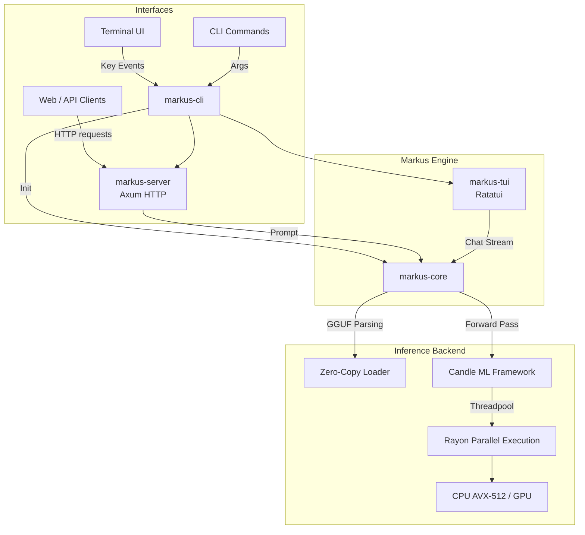
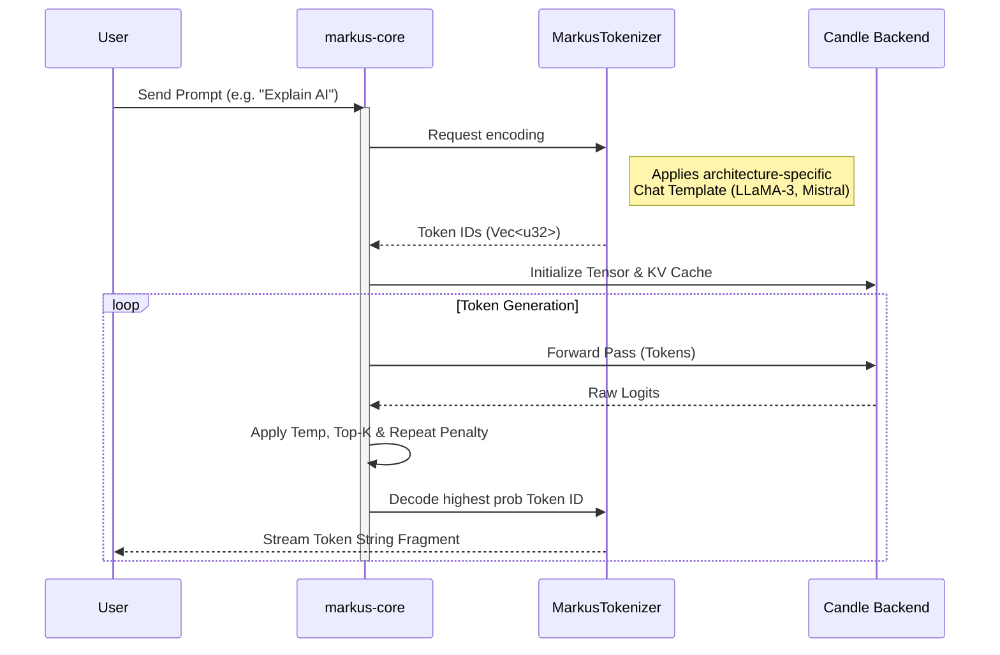

# 🚀 Markus Engine — v3.0.0

<div align="center">
  <p><strong>A blazing fast, memory-safe, pure Rust AI Model Manager & Inference Engine.</strong></p>
  <p>Zero <code>llama.cpp</code> dependencies. Fully standalone. Built on HuggingFace's <code>candle</code>.</p>
</div>

---

## 📑 Table of Contents

1. [What is Markus?](#-what-is-markus)
2. [Why Pure Rust?](#-why-pure-rust)
3. [System Architecture](#-system-architecture)
4. [Installation](#-installation)
5. [Usage & Commands](#-usage--commands)
6. [Detailed Inference Flow](#-detailed-inference-flow)
7. [Configuration](#-configuration)
8. [Roadmap & Future Vision](#-roadmap--future-vision)

---

## 🧠 What is Markus?

Markus is an advanced, independent Large Language Model (LLM) manager designed to run quantized GGUF models directly on your local CPU/GPU hardware. By dropping heavy C/C++ build pipelines and Python wrappers, Markus operates as a single `~15MB` binary that is extremely fast, predictable, and memory safe.

### Core Features
- **Native GGUF Parsing:** Zero-copy extraction of model architectures, weights, and tokenizers.
- **AVX/SIMD Optimized:** Automatically utilizes CPU extensions (AVX-512) for massive performance gains.
- **Dynamic Chat Templating:** Automatically detects if a model requires LLaMA-3 (`<|start_header_id|>`), Mistral (`[INST]`), or ChatML formats to ensure perfect output coherency.
- **OpenAI Compatible API:** Drop-in replacement for OpenAI endpoints via the `axum` HTTP server.

---

## 🦀 Why Pure Rust?

Historically, LLM execution pipelines have relied heavily on `llama.cpp` wrapped in Python bindings. While performant, this creates massive dependency headaches—users need GCC versions, CMake, build-essential, and gigabytes of compiled binaries.

**Markus v3 completely eliminates this.** 
- **Memory Safety:** Rust’s borrow checker guarantees no segfaults or memory leaks.
- **Microscopic Footprint:** No giant shared libraries.
- **Portability:** If it compiles, it runs. No missing `.so` or `.dll` files.

---

## 🏗️ System Architecture

Markus is divided into a highly modular Cargo workspace. Here is a high-level overview of how the internal components interact:



---

## ⚡ Installation

To install Markus globally so you can run it from any directory, just copy and paste the one-liner for your OS. The installer will clone the repo, compile with maximum hardware optimizations (`target-cpu=native`), and place the binary in your PATH.

### Linux & macOS
```bash
curl -sSL https://raw.githubusercontent.com/Precise-Goals/markus/main/install.sh | bash
```

### Windows (PowerShell)
```powershell
irm https://raw.githubusercontent.com/Precise-Goals/markus/main/install.ps1 | iex
```

*(Note: You will need [Rust](https://rustup.rs/) and `git` installed).*

---

## 🕹️ Usage & Commands

Once installed, you can simply type `markus` from **any directory** on your machine. 

### 1. Launch the Interactive TUI (Default)
```bash
markus
```
*Navigating the TUI:* Use arrow keys (or `j`/`k`) to move, `Enter` to select, and `q` to quit. The TUI includes isolated widgets for chatting, browsing local models, and monitoring system RAM/CPU.

### 2. Command Line Mode (CLI)
You can bypass the TUI and execute commands directly:

- **List local models:** `markus list`
- **Chat with a model in terminal:** `markus run 1` or `markus run qwen3`
- **Download a model:** `markus pull llama3.2`
- **Start OpenAI API Server:** `markus serve 1 --port 8080`
- **Show system hardware status:** `markus status`
- **Clear system RAM / drop caches:** `markus freemem`

---

## 🔄 Detailed Inference Flow

When you send a prompt to Markus, it uses asynchronous multi-threading to tokenize, evaluate, and stream the response back in real-time without blocking the user interface.



---

## ⚙️ Configuration

Markus stores its configuration in `~/.config/markus/config.toml` (or standard AppData paths on Windows/Mac). You can edit this file to customize engine behavior:

```toml
# markus-engine configuration
threads = 32                  # Number of Rayon threads to use for inference
ctx_size = 4096               # Maximum context window size
gpu_layers = 0                # Number of layers to offload to GPU (0 = pure CPU)
temperature = 0.7             # Default sampling temperature
repeat_penalty = 1.1          # Penalty for repeating tokens
system_prompt = "You are a helpful AI assistant."
```
To view or edit from the CLI, use: `markus config show` or `markus config edit`.

---

## 🚀 Roadmap & Future Vision

While Markus v3.0.0 serves as an ultra-fast local inference manager, the ultimate vision for Markus extends far beyond basic chat. 

**Upcoming Milestone:** We are planning to evolve Markus into a **Flexible, Servable Autonomous Agent Platform**. 

Similar to systems like `agy`, Markus will soon be capable of:
- Hosting self-directed autonomous agent workflows.
- Executing system-level tools, reading local repositories, and managing codebases securely.
- Operating as a completely self-hosted, private agentic backend that developers can deploy on their own infrastructure without relying on cloud APIs.

By building the foundation entirely in memory-safe Rust, the future agentic layer will be fast, secure, and infinitely scalable.

---
*License: MIT*
