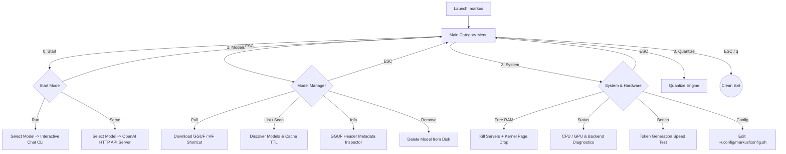

<div align="center">

```
  ███╗   ███╗ █████╗ ██████╗ ██╗  ██╗██╗   ██╗███████╗
  ████╗ ████║██╔══██╗██╔══██╗██║ ██╔╝██║   ██║██╔════╝
  ██╔████╔██║███████║██████╔╝█████╔╝ ██║   ██║███████╗
  ██║╚██╔╝██║██╔══██║██╔══██╗██╔═██╗ ██║   ██║╚════██║
  ██║ ╚═╝ ██║██║  ██║██║  ██║██║  ██╗╚██████╔╝███████║
  ╚═╝     ╚═╝╚═╝  ╚═╝╚═╝  ╚═╝╚═╝  ╚═╝ ╚═════╝ ╚══════╝
```

**Sleek · High-Performance · Universal Local LLM Manager & Chatbot TUI for Windows, Linux & macOS**  
*Powered by `llama.cpp` · Zero Config · Full OpenAI API Server · Universal GGUF Scanner*

[](https://opensource.org/licenses/MIT)
[](https://www.gnu.org/software/bash/)
[](https://github.com/ggerganov/llama.cpp)
[]()

</div>

---

## ⚡ One-Line Universal Installation

Install or update **MARKUS** globally across Windows, Linux, and macOS with a single command:

### 🪟 Windows (PowerShell, Windows Terminal, or CMD)
Run this command in **Windows PowerShell** or **Windows Terminal**:
```powershell
irm https://raw.githubusercontent.com/Precise-Goals/Markus/main/install.ps1 | iex
```
> **What the Windows installer does:**
> - Installs `markus`, `markus.ps1`, `markus.cmd`, and `markus.bat` into `%USERPROFILE%\.local\bin`.
> - Automatically adds `%USERPROFILE%\.local\bin` to your **Windows User PATH** so you can type `markus` natively from anywhere in PowerShell, CMD, or Windows Terminal.
> - Automatically detects your Git for Windows (Git Bash), MSYS2, Cygwin, or WSL environment and bridges commands transparently.
> - Detects `llama.cpp`, Ollama, and LM Studio backends across Windows paths (`AppData\Local`, `Programs`, etc.).

### 🐧 Linux & 🍏 macOS (Bash / Zsh / Git Bash / WSL)
```bash
curl -fsSL https://raw.githubusercontent.com/Precise-Goals/Markus/main/install.sh | bash
```
> **What the POSIX installer does:**
> - Detects system permissions (installs to `/usr/local/bin` with `sudo`, or `~/.local/bin` without sudo).
> - Initializes configuration directories (`~/.config/markus` and `~/.local/share/markus/models`).
> - Verifies your `llama.cpp` backend installation and offers automated dependency hints.

---

## 🌟 Visual ASCII Interface & Keyboard Control

Markus features a **flicker-free, relative-ANSI arrow-key Terminal UI (TUI)** designed for maximum aesthetics and lightning-fast navigation.

```
+=============================================================================+
|                      MARKUS  --  AI Model Manager v2.1.0                    |
+=============================================================================+
|                                                                             |
|  ->  ◆  Start             Run interactive chatbot CLI or HTTP API server    |
|      ◆  Models            Pull, list, scan, inspect metadata, or remove     |
|      ◆  System            Free RAM, hardware status, benchmark, config      |
|      ◆  Quantize          Re-quantize GGUF model files (Q4_K_M, Q8_0, etc.) |
|      ◆  Exit              Exit Markus                                       |
|                                                                             |
+=============================================================================+
|      [ ↑ / ↓ or j / k ] Navigate      [ Enter ] Select      [ ESC / q ] Back|
+=============================================================================+
```

### ⌨️ Keybindings

| Key | Action | Behavior |
| :---: | :--- | :--- |
| <kbd>↑</kbd> / <kbd>k</kbd> | **Navigate Up** | Move cursor selection up (wraps around) |
| <kbd>↓</kbd> / <kbd>j</kbd> | **Navigate Down** | Move cursor selection down (wraps around) |
| <kbd>1</kbd> – <kbd>9</kbd> | **Direct Jump** | Instantly select menu option by index number |
| <kbd>Enter</kbd> | **Confirm / Select** | Enter category, launch option, or execute command |
| <kbd>ESC</kbd> / <kbd>q</kbd> | **Back / Exit** | Instantly return to the previous menu or exit cleanly |

---

## 🏗 System Architecture & How It Works

Markus acts as an intelligent **native orchestration and state layer** over your local LLM ecosystem. It bridges filesystem discovery, kernel RAM reclamation, multi-call backend wrappers, and chat history management.

### ─── Architecture Flow Diagram ───

```
  +------------------+         +--------------------------------------------+
  |  USER TERMINAL   | <-----> |            MARKUS CORE (v2.1.0)            |
  +------------------+         +--------------------------------------------+
                                 |          |          |          |
         +-----------------------+          |          |          +-----------------------+
         | (1. Model Discovery)             |          | (2. RAM Optimization)        |
         v                                  |          v                              v
+----------------------------------+        |     +-------------------------+  +----------------------+
|       FILESYSTEM SCANNER         |        |     |  KERNEL CACHE / MEMORY  |  |  PERSISTENT STATE    |
+----------------------------------+        |     +-------------------------+  +----------------------+
| * ~/.cache/huggingface/hub/      |        |     | * Kill zombie processes |  | * ~/.config/markus/  |
| * ~/.ollama/models/              |        |     | * drop_caches (level 3) |  | * /tmp/markus_history|
| * ~/.local/share/markus/models/  |        |     | * vm.compact_memory     |  | * GGUF Header reader |
| * Custom user directories        |        |     +-------------------------+  +----------------------+
+----------------------------------+        |
                                            | (3. Smart Subcommand Routing)
                                            v
                               +----------------------------------------+
                               |         LLAMA.CPP INFERENCE            |
                               +----------------------------------------+
                               |  -> llama-cli     (Standalone binary)  |
                               |  -> llama-server  (REST API daemon)    |
                               |  -> llama-cpp-bin (All-in-one wrapper) |
                               +----------------------------------------+
                                                    |
                                                    v
                               +----------------------------------------+
                               |      HARDWARE ENGINE & AVX / CUDA      |
                               +----------------------------------------+
```

### ─── Interactive Workflow Pipeline ───



---

## 💻 CLI Commands & Usage Reference

You can operate Markus either through the **interactive TUI** (`markus`) or via direct non-blocking command-line arguments:

```bash
markus <command> [model] [options]
```

| Command | Arguments | Description | Example |
| :--- | :--- | :--- | :--- |
| **`run`** | `<model> [prompt]` | Launch interactive chat CLI (`-cnv`) or one-shot prompt | `markus run qwen2.5` |
| **`serve`** | `<model> [--port N]` | Start OpenAI-compatible HTTP API endpoint | `markus serve llama3.1 --port 8080` |
| **`pull`** | `<model-or-url>` | Download model from HuggingFace, shortcut, or URL | `markus pull qwen2.5` |
| **`list`** | *none* | Display formatted list of all detected local models | `markus list` |
| **`scan`** | `[--force]` | Search filesystem for GGUFs (6h cache TTL unless forced) | `markus scan --force` |
| **`info`** | `<model>` | Parse GGUF header, quantization type, parameters, and size | `markus info 1` |
| **`remove`** | `<model>` | Delete a model file from storage after confirmation | `markus remove qwen2.5` |
| **`quantize`** | `<model> [type]` | Re-quantize GGUF weights (`Q4_K_M`, `Q8_0`, `F16`, etc.) | `markus quantize llama3.1 Q4_K_M` |
| **`bench`** | `<model>` | Run token-generation speed benchmark (tokens/sec) | `markus bench qwen2.5` |
| **`freemem`** | *none* | Kill background servers and drop kernel memory caches | `markus freemem` |
| **`status`** | *none* | Check hardware, RAM/VRAM, backends, and listening services | `markus status` |
| **`config`** | `show \| set \| edit` | Read or modify persistent `~/.config/markus/config.sh` | `markus config set THREADS 16` |

---

## 🔍 Deep Dive: Advanced Capabilities

### 1. 🌐 Universal Model Scanner & Cache Layer
Markus eliminates model duplication. It searches your system across all major AI tool directories and caches the index for 6 hours:
* **HuggingFace Hub Cache**: `~/.cache/huggingface/hub/`
* **Ollama Storage**: `~/.ollama/models/`
* **LM Studio Models**: `~/.cache/lm-studio/models/`
* **Markus Storage**: `~/.local/share/markus/models/`
* **System Libraries**: `/usr/local/share/models/`, `/usr/share/models/`

### 2. ⚡ Smart Subcommand & Backend Engine
Markus automatically detects your installed `llama.cpp` binaries (`/usr/local/lib/ollama/llama-server`, `/usr/bin/llama-cli`, or `~/.local/bin/llama-cpp-bin`).
* **Standalone vs. Multi-call Wrapper**: If you use an official all-in-one wrapper like `llama-cpp-bin`, Markus automatically injects the required subcommand (`cli`, `serve`, `quantize`, `bench`).
* **Conversation Mode Compatibility**: Automatically detects whether your binary supports modern `-cnv` (`--conversation`) or legacy `-i` flags.

### 3. 💬 OpenAI-Compatible REST API Server
Turn any local model into an OpenAI-compatible API endpoint instantly:
```bash
markus serve qwen2.5 --port 8080
```
Then connect with any tool, agent, or SDK:
```bash
curl http://127.0.0.1:8080/v1/chat/completions \
  -H "Content-Type: application/json" \
  -d '{
    "model": "qwen2.5",
    "messages": [{"role": "user", "content": "Explain quantum computing in one sentence."}],
    "temperature": 0.7
  }'
```

### 4. 🧹 Deep Kernel RAM Reclamation (`freemem`)
Running multiple models can exhaust Linux page cache and RAM. Markus provides a one-click deep system clean:
```bash
markus freemem
```
1. Terminates zombie `llama-server` / `llama-cli` processes.
2. Synchronizes filesystem buffers (`sync`).
3. Drops Linux kernel page cache, dentries, and inodes (`echo 3 > /proc/sys/vm/drop_caches`).
4. Triggers memory compaction (`vm.compact_memory`).

---

## 🛠 Persistent Configuration (`config.sh`)

Your settings live in `~/.config/markus/config.sh`. Modify them via menu or command:

```bash
# markus configuration
THREADS=16
CTX_SIZE=4096
BATCH_SIZE=512
GPU_LAYERS=0
TEMPERATURE=0.7
TOP_P=0.9
TOP_K=40
REPEAT_PENALTY=1.1
MAX_TOKENS=-1
SERVER_HOST=127.0.0.1
SERVER_PORT=8080
```

---

## 🤝 Contributing & License

We welcome pull requests and issues!  
This project is licensed under the **MIT License** — free to use, modify, and distribute.

<div align="center">

```
+-----------------------------------------------------------------------------+
|                      Built with ❤️ for Local AI Freedom                     |
+-----------------------------------------------------------------------------+
```

</div>
